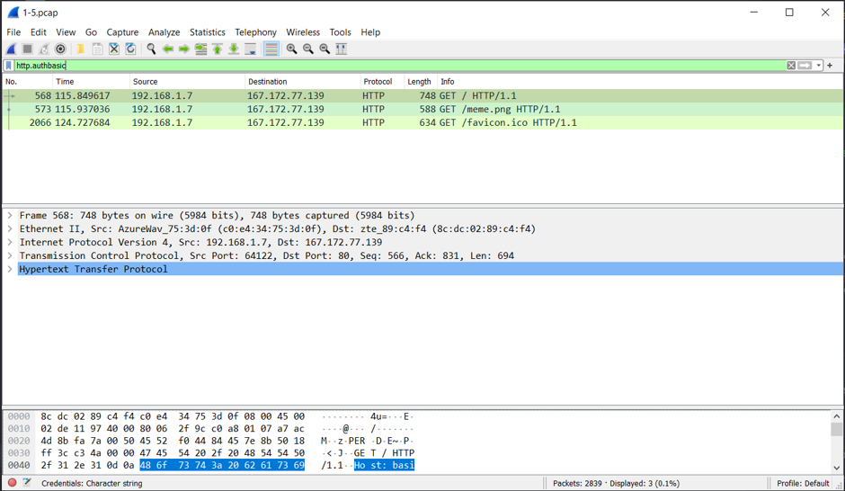

# Jarkom-Modul-1-D05-2021

## 1. Sebutkan webserver yang digunakan pada "_ichimarumaru.tech_"!

### Jawaban

Inputkan pada display filter: _(http.host == ichimarumaru.tech)_

 Kemudian klik paket paling atas kemudian pilih Analyze > Follow > HTTP Stream

 Terlihat bahwa web server yang digunakan adalah nginx/1.18.0

## 2. Temukan paket dari web-web yang menggunakan basic authentication method!

### Jawaban

Inputkan pada display filter: _(http.authbasic)_

## 3. Ikuti perintah di _basic.ichimarumaru.tech_! Username dan password bisa didapatkan dari file .pcapng!

Inputkan display filter: http.host == basic.ichimarumaru.tech

 Dapat terlihat data username = “_kuncimenujulautan_” dan password = “_tQKEJFbgNGC1NCZlWAOjhyCOm6o3xEbPkJhTciZN_”

 Soal pada website _basic.ichimarumaru.tech_ berisi "Sebutkan urutan konfigurasi pengkabelan T568A!". Yang memiliki jawaban : "Putih hijau - Hijau - Putih orange - Biru - Putih Biru - Orange - Putih Cokelat - Cokelat"

## 4. Temukan paket mysql yang mengandung perintah query select!

Inputkan display filter: mysql.query matches “select”

## 5. Login ke _portal.ichimarumaru.tech_ kemudian ikuti perintahnya! Username dan password bisa didapat dari query insert pada table users dari file .pcap!

Inputkan display filter: mysql.query matches “insert”

 Soal pada website _basic.ichimarumaru.tech_ berisi "Sebutkan urutan konfigurasi pengkabelan T568B!". Yang memiliki jawaban : "Putih Oranye - Oranye - Putih Hijau - Biru - Putih Biru - Hijau - Putih Cokelat - Cokelat"

## 6. Cari username dan password ketika melakukan login ke FTP Server!

Inputkan display filter: ftp contains USER or ftp contains PASS

 Terlihat data username = “secretuser” dan password = “aku.pengen.pw.aja”

## 7. Ada 500 file zip yang disimpan ke FTP Server dengan nama 0.zip, 1.zip, 2.zip, ..., 499.zip. Simpan dan Buka file pdf tersebut. (Hint = nama pdf-nya "Real.pdf")

Inputkan display filter: ftp-data contains Real.pdf

 Setelah itu klik paket teratas kemudian Analyze > Follow > TCP Stream dan show data as Raw

 Kemudian save as “Real.pdf”, setelah dibuka akan muncul

## 8. Cari paket yang menunjukan pengambilan file dari FTP tersebut!

Inputkan display filter: ftp.request.command == RETR

 Dapat telihat tidak ada paket yang menunjukkan pengambilan file dari FTP tersebut

## 9. Dari paket-paket yang menuju FTP terdapat inidkasi penyimpanan beberapa file. Salah satunya adalah sebuah file berisi data rahasia dengan nama "secret.zip". Simpan dan buka file tersebut!

Inputkan display filter: ftp-data.command contains secret.zip

 Setelah itu pilih salah satu paket, Analyze > Follow > TCP Stream kemudian view data as Raw dan save as secret.zip

 Pada secret.zip berisi file Wanted.pdf

## 10. Selain itu terdapat "history.txt" yang kemungkinan berisi history bash server tersebut! Gunakan isi dari "history.txt" untuk menemukan password untuk membuka file rahasia yang ada di "secret.zip"!

Inputkan display filter: ftp-data.command contains history.txt

 Setelah itu pilih paket, Analyze > Follow > TCP Stream

 Terlihat bahwa password zip berada pada bukanapaapa.txt

Inputkan display filter: ftp-data.command contains bukanapaapa.txt

 Setelah itu pilih paket, Analyze > Follow > TCP Stream

 Terlihat passwordnya adalah “d1b1langbukanapaapajugagapercaya” dan isi dari Wanted.pdf adalah

## 11. Filter sehingga wireshark hanya mengambil paket yang berasal dari port 80!

Inputkan capture filter: src port 80

## 12.	Filter sehingga wireshark hanya mengambil paket yang mengandung port 21!

Inputkan capture filter: port 21

## 13.	Filter sehingga wireshark hanya menampilkan paket yang menuju port 443!

Inputkan capture filter: dst port 443

## 14.	Filter sehingga wireshark hanya mengambil paket yang tujuannya ke kemenag.go.id!

Inputkan capture filter: dst host kemenag.go.id

## 15.	Filter sehingga wireshark hanya mengambil paket yang berasal dari ip kalian!

Inputkan capture filter: src host 192.168.43.129

